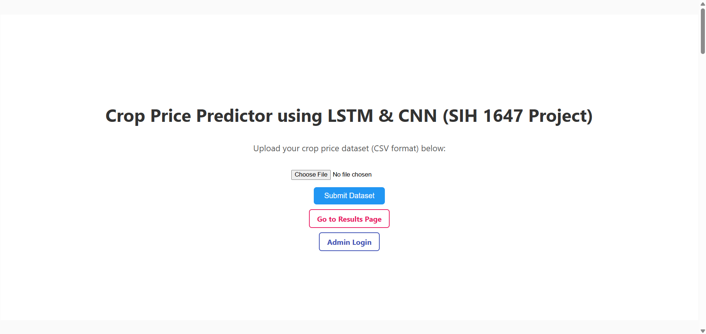
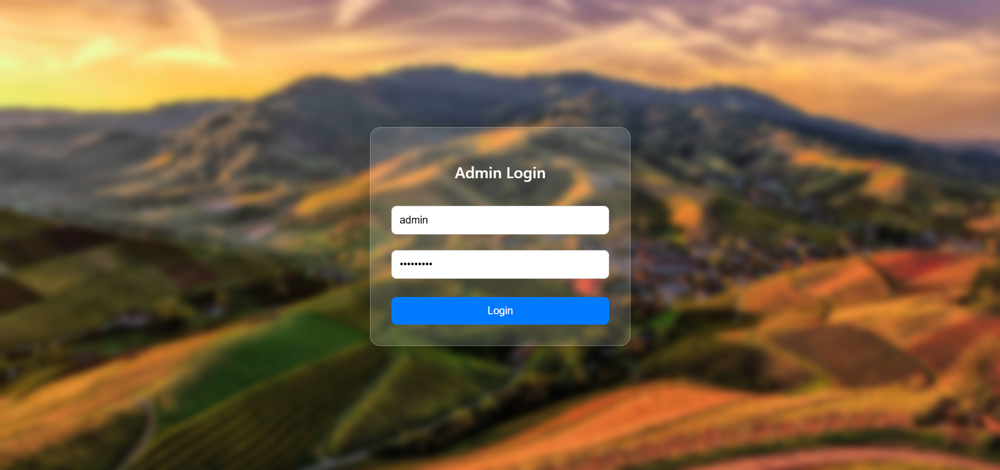

#  Crop Price Prediction System + Web Interface to publish results - SIH 2024

Welcome to the Crop Price Prediction System with Web Interface — a comprehensive Data Science, Machine Learning, and Web Development project developed by Team Xebec’s Crew for Smart India Hackathon (SIH) 2024.

This project is centered around forecasting market prices of vegetables using historical data and advanced time-series modeling techniques. The predicted results are then published on a dedicated web platform, aiming to support farmers and government agencies in making data-driven decisions related to crop sales, logistics, and timely market interventions.

Prototype Website : https://sih-project-self.vercel.app/

---

## Problem Statement

**Domain:** Agriculture & Market Linkage  
**Challenge:** Predict future vegetable market prices using past data to support price transparency, optimize supply-chain decisions, and provide an interface for the input and results.

---

## Project Structure

```bash
SIH_PROJECT/
│
├── Webpage/
│   ├── api/                # Flask backend
│   │   ├── app.py
│   │   ├── requirements.txt   # All webpage dependencies
│   │   └── uploads/
│   └── frontend/           # React frontend
│       ├── src/
│       │   ├── components/
│       │   ├── App.js
│       │   └── index.js
│       └── public/
├── data/
│   ├── raw/                       # Original input files (CSV, PDFs)
│   │   └── kalimati_tarkari_dataset.csv
│   │   └── SIH2024_1647_Xebec's_Crew.pdf
│
├── reports/
│   ├── figures/                  # Visualizations and model performance plots
│   │   └── Screenshot_*.png
│
├── src/                          # Source code for data loading, modeling, utils
│   ├── __init__.py
│   ├── data_loader.py
│   ├── preprocessing.py
│   ├── arima_model.py
│   ├── lstm_model.py
│   └── utils.py
│
├── presentation/                # SIH submission and PPTs
│   └── (Your final presentation slides or PDF)
│
├── LICENSE
├── README.md
└── requirements.txt             # All Python dependencies
````

---
# Development Section:
## Overview

The system is built with a **React frontend** and a **Flask + MongoDB backend**. It enables users to:

- Upload crop price datasets
- View predicted **intervention dates** based on LSTM+CNN model forecasts
- Allow admins to **post, update, and delete** results from a secure admin panel
- Store all uploaded datasets and results dynamically in MongoDB

**Note**: The LSTM+CNN model runs externally and is not part of this deployed web app. Instead, the web platform serves as a service interface for client interaction and result display.

## Features

- Upload datasets via a public user dashboard
- Secure admin login with session-based authentication
- Real-time admin panel to post, update, and delete results
- Dynamic result storage using MongoDB
- RESTful API endpoints to handle results and dataset uploads
- Mobile-responsive design using CSS
- Deployed frontend (React) via **Vercel**
- Deployed backend (Flask + MongoDB) via **Render**

## Tech Stack

- **Frontend**: React, CSS, React Router
- **Backend**: Flask, MongoDB (via PyMongo), Gunicorn (for deployment), Python-dotenv
- **APIs**: REST APIs for all client-server communication
- **Database**: MongoDB Atlas
- **Deployment**:
  - React: Vercel
  - Flask: Render
 
## Webpage Screenshots:
### Main Dashboard View (Upload Dataset in csv format and links to other pages)


### Scroll down to find FAQ's


### Admin login page


### Admin dashboard (to update delete results in real-time)


### Results page (public, entries can be edited from the admin page only)


## Setup Instructions

### Backend (Flask)

```bash
cd Webpage/api
pip install -r requirements.txt
```
-Create a .env file in Webpage/api with the following content:
 MONGO_URI=your_mongodb_connection_string
-Then start the development server:
```bash
python app.py
```
### Frontend (React)
```bash
cd Webpage/frontend
npm install
npm start
```

# AI-ML Section:

##  How to Run the Project

### 1. Install Dependencies

Make sure you are using Python 3.8+. Then run:

```bash
pip install -r requirements.txt
```

---

### 2. Load and Preprocess the Data

```bash
python src/data_loader.py
python src/preprocessing.py
```

---


### 3. Train Models

#### ARIMA Model:

```bash
python src/arima_model.py
```

#### LSTM Model:

```bash
python src/lstm_model.py
```

---

### 4. Visualize Results

All generated plots (model loss, price forecasts, trend analysis) will be saved in the:

```bash
reports/figures/
```

---

## Features

*    **ARIMA Model:** Classical time-series forecasting on crop price trends.
*    **LSTM Model:** Deep learning approach for better long-term dependency capture.
*    **Preprocessing Pipeline:** Normalization, time-indexing, and missing data handling.
*    **Visual Reporting:** Forecast and evaluation plots.
*    **Modular Codebase:** Separated scripts for easy testing and reusability.

---

## Sample Visualizations

You can find screenshots and output plots inside the `reports/figures/` folder. These illustrate trends, predictions vs actual values, model evaluation metrics, etc.

---

## Dataset

We used the **Kalimati Tarkari Dataset** (publicly available), which contains:

* Historical prices of vegetables
* Market-level transaction volume
* Timestamped entries from Kalimati market

Path:
`data/raw/kalimati_tarkari_dataset.csv`

---

## Presentation

The `presentation/` folder contains the final PDF/PPT submission made for **SIH 2024**, including:

* Problem Statement
* Proposed Solution
* Architecture Diagrams
* Model Performance & Results
* Business Impact

---

## Future Scope

* Integrate the model into the Website.
* Add more crops and markets across India
* Use Reinforcement Learning for decision making

---

## Authors & Team

**Xebec's Crew – SIH 2024**
Team Members:
* Mridul Chouhan *(Team Leader & Backend Developer)*
* Anik Panja *(Lead ML Engineer)*
* Arkadip Ghara *(ML Engineer)*
* Siddharth Patel *(Finance Analyst)*
* Satyabratta Biswal *(Frontend Developer)*

---

## License

This project is licensed under the [MIT License](LICENSE).

---

## Contact

For any questions or collaborations:
* 📧 [MridulChouhan@gmail.com](mailto:strangemridul@gmail.com)
* 📧 [anikpanja362@gmail.com](mailto:anikpanja362@example.com) 

---

